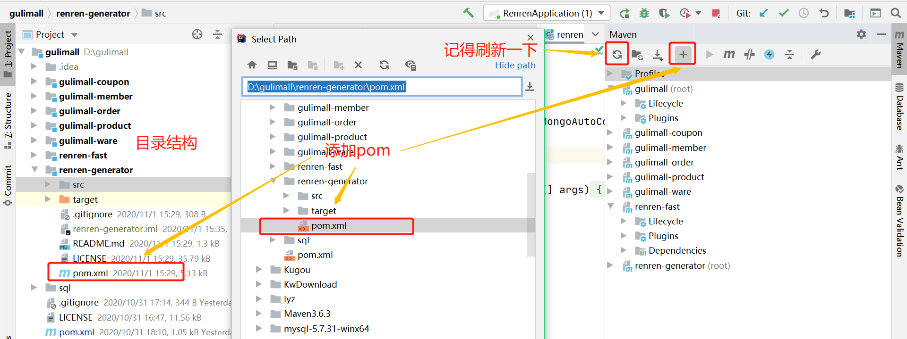
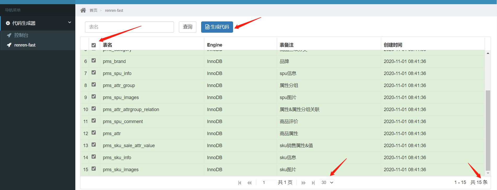
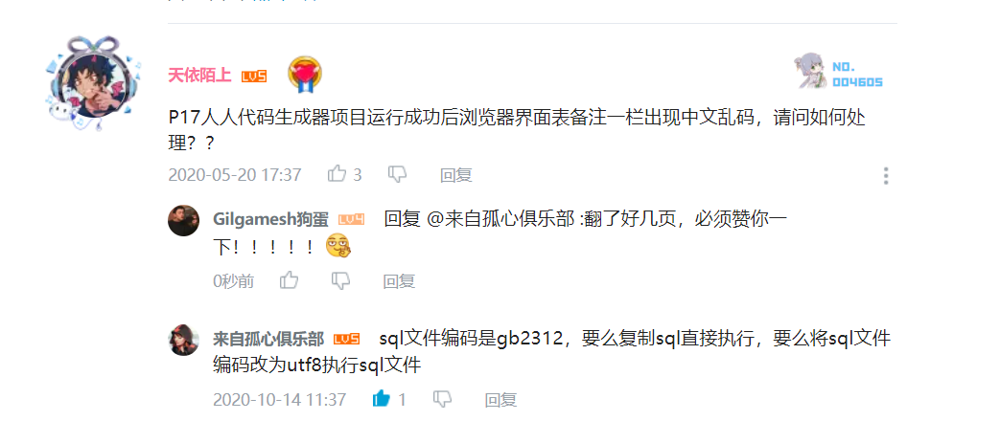
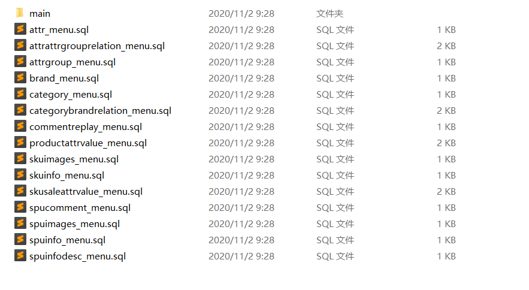
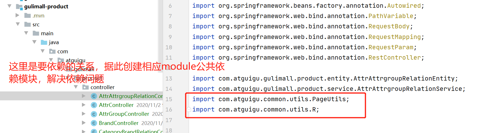
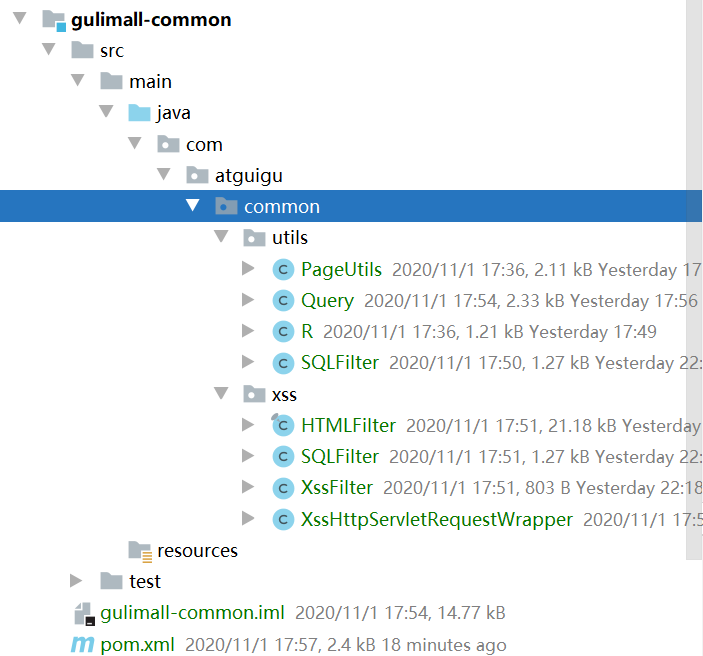
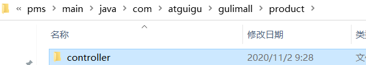

# P17 逆向工程搭建和使用

1. 下载renren-generator

   ```bash
   git clone https://gitee.com/renrenio/renren-generator.git
   ```

2. 将下载的module添加到IDEA工程中，并将此module的pom文件加入到maven中

   

3. 修改相应的配置文件

   1. generator.properties

      ```properties
      #这里拿product module做示例
      mainPath=com.atguigu
      #包名
      package=com.atguigu.gulimall
      moduleName=product
      #作者
      author=lucifer
      #Email
      email=1342547278@qq.com
      #表前缀(类名不会包含表前缀)
      tablePrefix=pms_
      ```

   2. applicationl.yml

      ```yaml
      # mysql
      spring:
        datasource:
          type: com.alibaba.druid.pool.DruidDataSource
          #MySQL配置
          driverClassName: com.mysql.cj.jdbc.Driver
          url: jdbc:mysql://192.168.56.10:3306/gulimall_pms?useUnicode=true&characterEncoding=UTF-8&useSSL=false&serverTimezone=Asia/Shanghai
          username: root
          password: root
      ```

4. 启动renren-fast，renren-fast-vue，renren-generator，记得开启数据库

5. 进入网页http://localhost/#generator.html

6. 下载

> 这里表备注可能会乱码，解决方案：
>
> 

7. 下载之后，解压得到文件如图将main文件夹复制粘贴到IDEA的product module中去

8. common文件（直接将renren-fast的common/utils复制过来，但是pom文件记得添加renren-fast的依赖，下面的pom最后一个依赖，这样做省事，但是会引入一些不用的依赖，建议这样，后续省事，自己取舍）

   common的pom文件

   ```pom
   <?xml version="1.0" encoding="UTF-8"?>
   <project xmlns="http://maven.apache.org/POM/4.0.0"
            xmlns:xsi="http://www.w3.org/2001/XMLSchema-instance"
            xsi:schemaLocation="http://maven.apache.org/POM/4.0.0 http://maven.apache.org/xsd/maven-4.0.0.xsd">
       <parent>
           <artifactId>gulimall</artifactId>
           <groupId>com.atguigu.gulimall</groupId>
           <version>0.0.1-SNAPSHOT</version>
       </parent>
       <description>每一个模块公共的依赖，bean，工具类等</description>
       <modelVersion>4.0.0</modelVersion>
   
       <artifactId>gulimall-common</artifactId>
   
       <dependencies>
           <dependency>
               <groupId>com.baomidou</groupId>
               <artifactId>mybatis-plus</artifactId>
               <version>3.3.1</version>
           </dependency>
   
           <dependency>
               <groupId>com.baomidou</groupId>
               <artifactId>mybatis-plus-core</artifactId>
               <version>3.3.1</version>
           </dependency>
   
           <dependency>
               <groupId>com.baomidou</groupId>
               <artifactId>mybatis-plus-extension</artifactId>
               <version>3.3.1</version>
           </dependency>
   
           <dependency>
               <groupId>org.projectlombok</groupId>
               <artifactId>lombok</artifactId>
           </dependency>
   
   <!--        <dependency>-->
   <!--            <groupId>org.apache.shiro</groupId>-->
   <!--            <artifactId>shiro-core</artifactId>-->
   <!--            <version>1.4.0</version>-->
   <!--        </dependency>-->
   
   <!--        <dependency>-->
   <!--            <groupId>org.apache.shiro</groupId>-->
   <!--            <artifactId>shiro-spring</artifactId>-->
   <!--            <version>1.4.0</version>-->
   <!--        </dependency>-->
           <!-- https://mvnrepository.com/artifact/org.apache.httpcomponents/httpcore -->
           <dependency>
               <groupId>org.apache.httpcomponents</groupId>
               <artifactId>httpcore</artifactId>
               <version>4.4.12</version>
           </dependency>
   
           <dependency>
               <groupId>commons-lang</groupId>
               <artifactId>commons-lang</artifactId>
               <version>2.6</version>
           </dependency>
           <dependency>
               <groupId>io.renren</groupId>
               <artifactId>renren-fast</artifactId>
               <version>3.0.0</version>
               <scope>compile</scope>
           </dependency>
       </dependencies>
   </project>
   ```

   这些做完之后会有一个报错，在controller的java文件中，所有的RequiresPermissions爆红，可以忽略，其他的自己要重新解决依赖关系。

9. 修改generator文件

   ```java
   注释掉以下代码
   ##import org.apache.shiro.authz.annotation.RequiresPermissions;
   ##    @RequiresPermissions("${moduleName}:${pathName}:list")
   ##    @RequiresPermissions("${moduleName}:${pathName}:info")
   ##    @RequiresPermissions("${moduleName}:${pathName}:save")
   ##    @RequiresPermissions("${moduleName}:${pathName}:update")
   ##    @RequiresPermissions("${moduleName}:${pathName}:delete")
   这样生成的逆向工程就不会生成RequiresPermissions注释，暂时用不到的。用来解决controller的RequiresPermissions爆红问题。
   ```

10. 重复步骤5，解压，然后将IDEA中的controller替换掉

11. 至此文件应该是这样婶的，截图太长，总之就是全绿！