# P19 快速开发逆向生成所有微服务基本CRUD代码

设置各个模块的端口号：

```yml
coupon	7000
member	8000
order	9000
product	10001(原10000，因经常冲突改为10001)
ware	11000
gateway 88
renren-fast（后端） 8080
renren-fast-vue（前端） 8001
nacos 8848
mysql 3306

```

bug：

> 不知道为什么我的IDEA不能识别后缀为yaml的文件，但是可以识别yml文件


*虽然步骤同==P18== 一样，但是还是写一写吧，加深印象*

##### 使用renren-generator生成代码（以order模块为例，其他大同小异）

1. 找到以下文件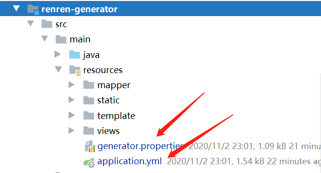

2. 修改对应配置

   1. generator.properties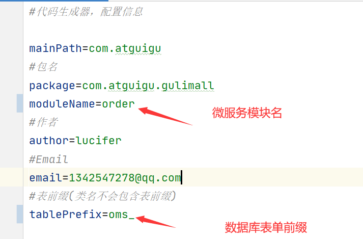

      ```properties
      #代码生成器，配置信息
      
      mainPath=com.atguigu
      #包名
      package=com.atguigu.gulimall
      moduleName=order
      #作者
      author=lucifer
      #Email
      email=1342547278@qq.com
      #表前缀(类名不会包含表前缀)
      tablePrefix=oms_
      ```

   2. 修改对应的application.yml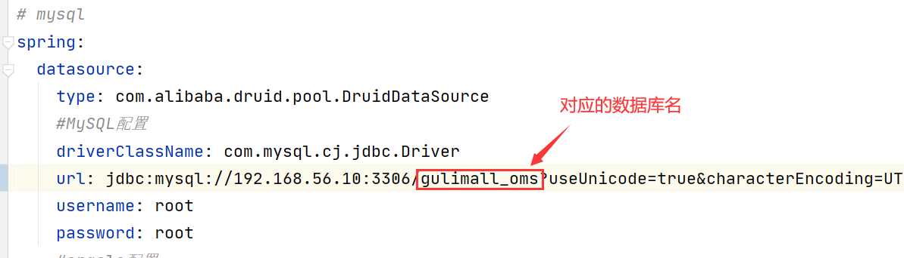

##### 逆向生成代码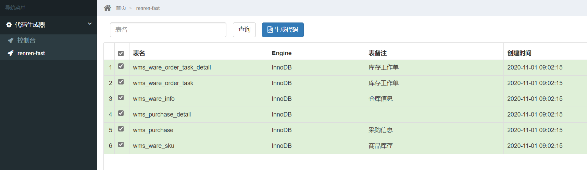

##### 将对应代码添加到idea中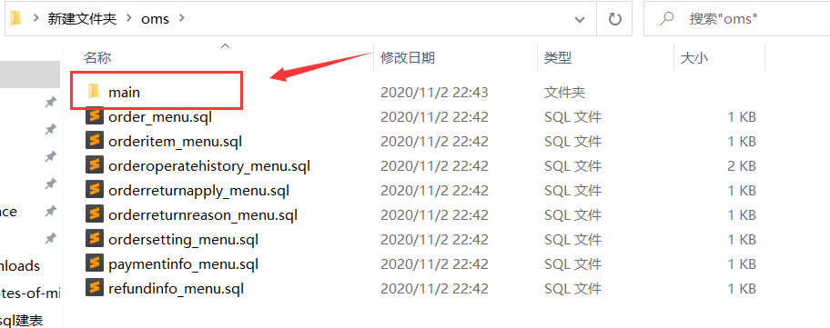

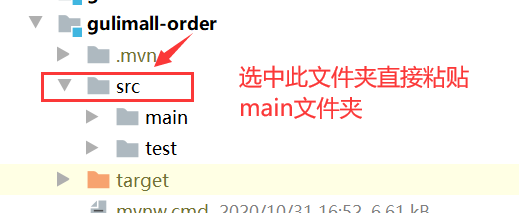

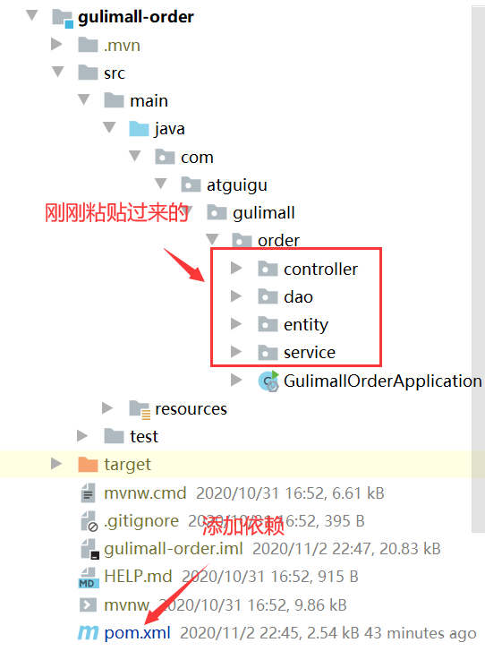

```pom
在pom文件中添加gulimall-common依赖

<dependency>
            <groupId>com.atguigu.gulimall</groupId>
            <artifactId>gulimall-common</artifactId>
            <version>0.0.1-SNAPSHOT</version>
        </dependency>
```

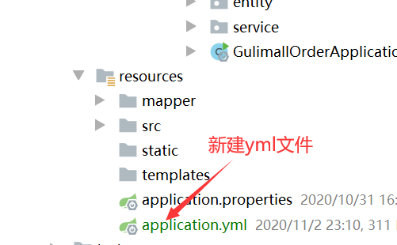

```yml
在application.yml文件中添加配置信息如下

spring:
  datasource:
    username: root
    password: root
    url: jdbc:mysql://192.168.56.10:3306/gulimall_oms
    driver-class-name: com.mysql.cj.jdbc.Driver

mybatis-plus:
  mapper-locations: classpath:/mapper/**/*.xml
  global-config:
    db-config:
      id-type: auto

server:
  port: 9000
```

#### 最后启动该微服务进行测试。

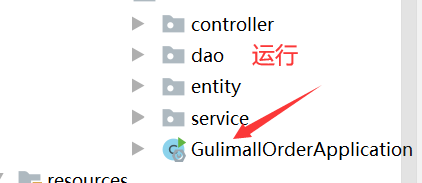

随便找一个controller进行测试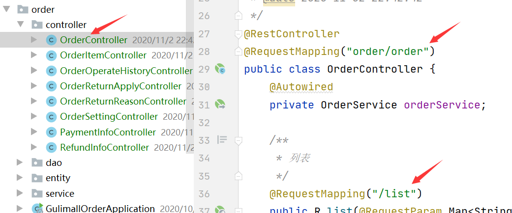


由于没有数据所以只会输出一串json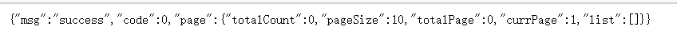

至此，此模块完成。同理其他微服务模块也是如此操作，在执行过程中只需要修改对应的数据库名，端口号，表单前缀等即可。