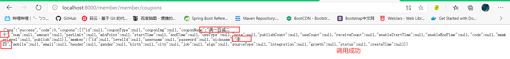

# P22 分布式组件-SpringCloud Alibaba-OpenFeign测试远程调用

### Feign声明式远程调用

#### **简介：**

​	Feign是一个声明式的HTP客户端，它的目的就是让远程调用更加简单。Feign提供了HTTP请求的模板，通过编写简单的接口和插入注解，就可以定义好HTP请求的参数、格式、地址等信息。Feign整合了Ribbon(负载均衡）和Hystrix(服务熔断）,可以让我们不再需要显式地使用这两个组件。
​	SpringCloudFeign在NetflixFeign的基础上扩展了对SpringMVC注解的支持，在其实现下，我们只需创建一个接口并用注解的方式来配置它，即可完成对服务提供方的接口绑定。简化了SpringCloudRibbon自行封装服务调用客户端的开发量。

#### 测试member——coupon服务调用（例：会员获取所有的优惠券信息）


编写coupon的controller.CouponController文件，添加想要的功能。

```java
  @RequestMapping("/member/list")
    public R memberCoupons(){
        CouponEntity couponEntity=new CouponEntity();
        couponEntity.setCouponName("满一百减二十");

        return R.ok().put("coupons", Arrays.asList(couponEntity));
    }
```


1. 使用（各个微服务模块引入OpenFeign依赖，创建的时候已经引入了）

   ```xml
   <dependency>
               <groupId>org.springframework.cloud</groupId>
               <artifactId>spring-cloud-starter-openfeign</artifactId>
           </dependency>
   ```

2. 编写接口，告诉SpringCloud这个接口需要调用远程服务

   > 1、将接口都放在member module的OpenFeign包下 ，编写方法，声明接口每一个方法都是调用哪一个远程服务的哪一个请求

   ```java
   @FeignClient("gulimall-coupon")
   public interface CouponFeignService {
   
       @RequestMapping("coupon/coupon/member/list")
       public R memberCoupons();
   
   }
   
   ```

   > 2、在启动类上，开启远程调用功能

   ```java
   @EnableFeignClients(basePackages = "com.atguigu.gulimall.member.feign")
   @SpringBootApplication
   public class GulimallMemberApplication {
   
       public static void main(String[] args) {
           SpringApplication.run(GulimallMemberApplication.class, args);
       }
   
   }
   ```

   

编写member module的测试功能方法（controller.MemberController）

```java
  @Autowired
    CouponFeignService couponFeignService;

    @RequestMapping("/coupons")
    public R test(){
        MemberEntity memberEntity=new MemberEntity();
        memberEntity.setNickname("李四");
//        R membercoupons=couponFeignService.memberCoupons();
//        return R.ok().put("member",memberEntity).put("coupons",membercoupons.get("coupons"));

        return R.ok().put("member",memberEntity).put("coupons",couponFeignService.memberCoupons().get("coupons"));

    }

```


最后开启，coupon和member这两个module，并输入网址进行测试。

地址：http://localhost:8000/member/member/coupons

