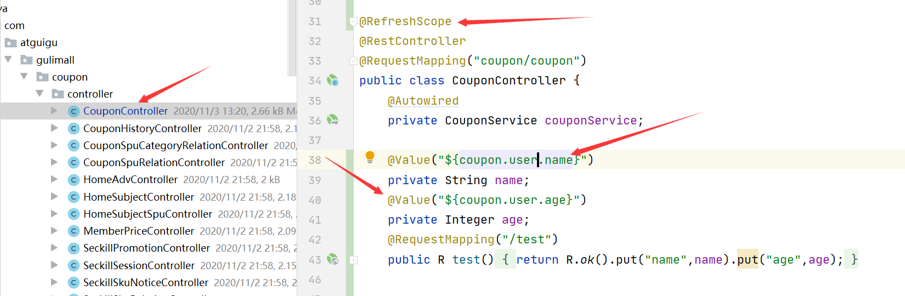
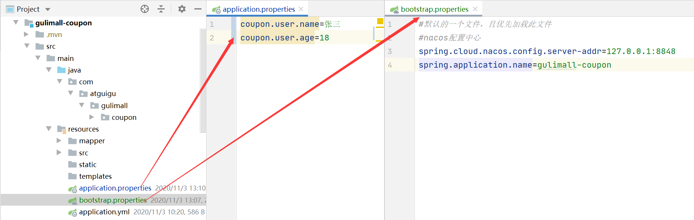
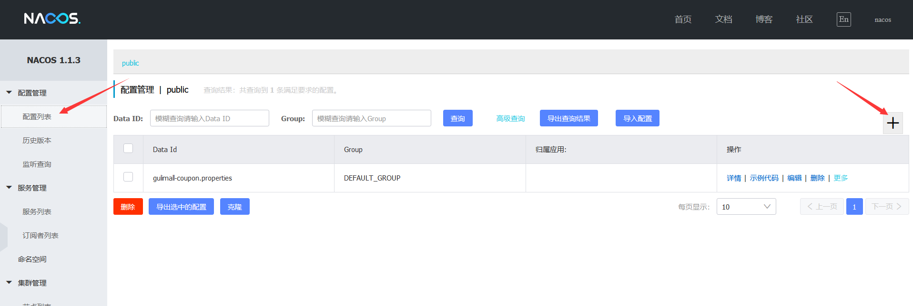
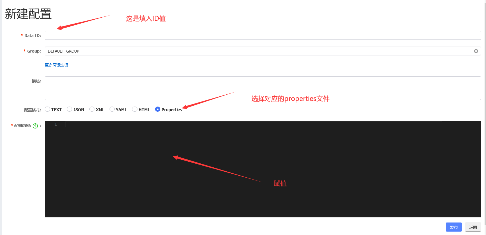
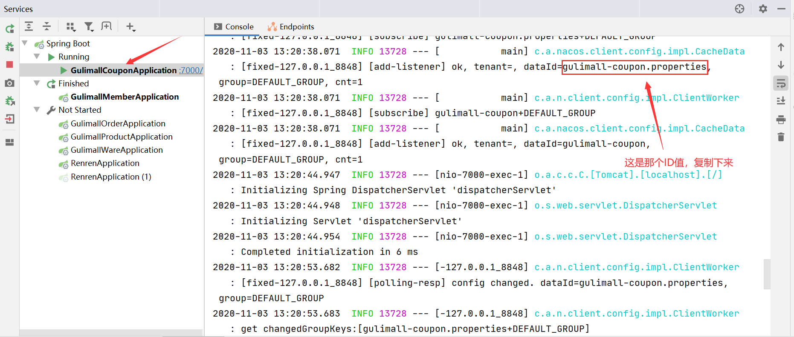
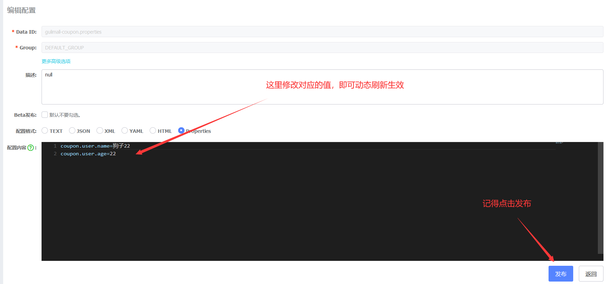

# P23	分布式组件-SpringCloud Alibaba-Nacos配置中心 简单示例

[官网配置中心示例](https://github.com/alibaba/spring-cloud-alibaba/blob/master/spring-cloud-alibaba-examples/nacos-example/nacos-config-example/readme-zh.md)

### 这节以gulimall-coupon为例

因为每个微服务都可能会使用配置中心的功能，所以在公共common中添加依赖关系。

1. 首先，修改gulimall-common的pom.xml 文件，引入 Nacos Config Starter。

   ```xml
    <dependency>
        <groupId>com.alibaba.cloud</groupId>
        <artifactId>spring-cloud-starter-alibaba-nacos-config</artifactId>
    </dependency>
   ```

2. 在gulimall-coupon中添加resources/bootstrap.properties 配置文件中配置 Nacos Config 元数据

   ```properties
    spring.application.name=gulimall-coupon
    spring.cloud.nacos.config.server-addr=127.0.0.1:8848
   ```

3. 完成上述两步后，应用会从 Nacos Config 中获取相应的配置，并添加在 Spring Environment 的  PropertySources 中。这里我们使用 @Value 注解来将对应的配置注入到 SampleController 的 userName 和 age 字段，并添加 @RefreshScope 打开动态刷新功能。

4. 测试

   ​	地址：http://localhost:7000/coupon/coupon/test

   

5. 配置nacos文件，首先新建文件

6. 新建配置里的ID值

7. 最终文件

*说明*：

> 1、引入依赖
>
> 2、创建一个bootstrap.properties，并配置元数据
>
> 3、需要给配置中心默认添加一个叫  数据集（Data Id）gulimall-coupon.properties 默认规则
>
> 4、动态获取数据，开启@RefreshScope和@Value注解
>
> 5、给配置中心的数据集，即properties添加配置
>
> 6、当本地的application.properties和nacos配置中的properties文件同时存在时，优先加载使用nacos的配置。并不是不使用本地的properties文件，它也加载使用，只不过优先级比nacos的低而已！

