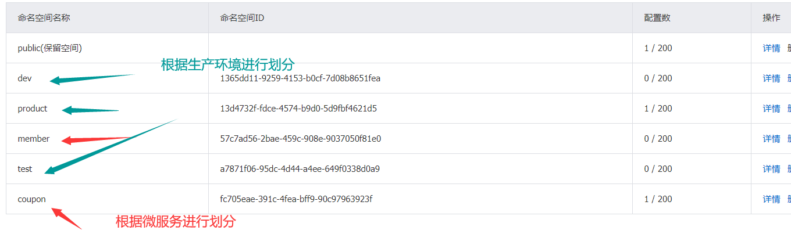
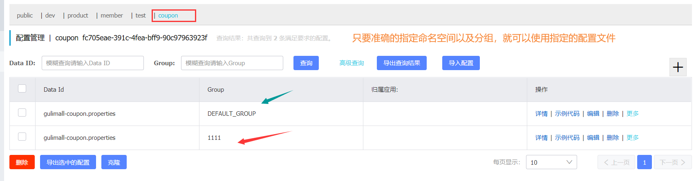
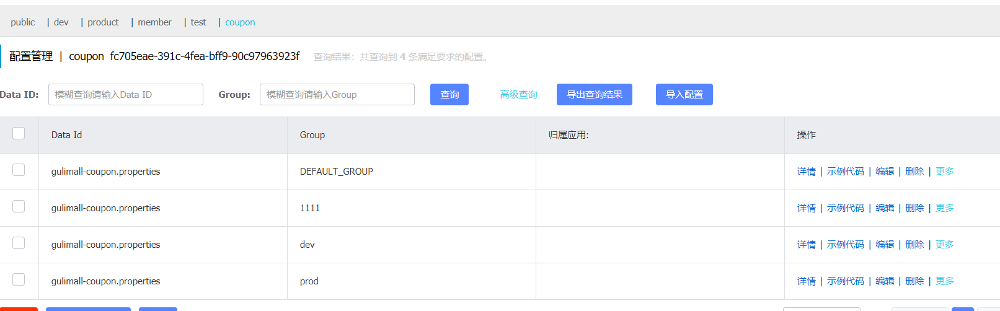

# P24 分布式组件 SpringCloud Alibaba-Nacos配置中心-命名空间与配置分组


#### 细节：

1. 命名空间（配置隔离）：

   - 默认是public（保留空间）：默认新增的所有配置都在public空间。

   - 可以利用开发、测试、生产等进行命名空间划分，进行环境隔离，注意在bootstrap.properties配置上，可以选择使用哪一个命名空间配置
   - 每一个微服务之间相互隔离配置，每一个微服务都创建自己的命名空间，只加载自己命名空间下的所有配置（个人推荐）
   - 

2. 配置集：所有的配置的集合

3. 配置集ID：类似文件名。

   Data ID：类似文件名

4. 配置分组

   默认所有的配置集都属于：DEFAULT_GROUP：

   可以根据需求创建，比如，双十一（1111），六一八（618），双十二（1212）

   ```properties
   #指定命名空间，默认public
   spring.cloud.nacos.config.namespace=fc705eae-391c-4fea-bff9-90c97963923f
   #指定分组，默认是Default_Group
   spring.cloud.nacos.config.group=1111
   ```

   

为每个微服务创建命名空间，使用配置分组区分环境（dev、test、prod）

