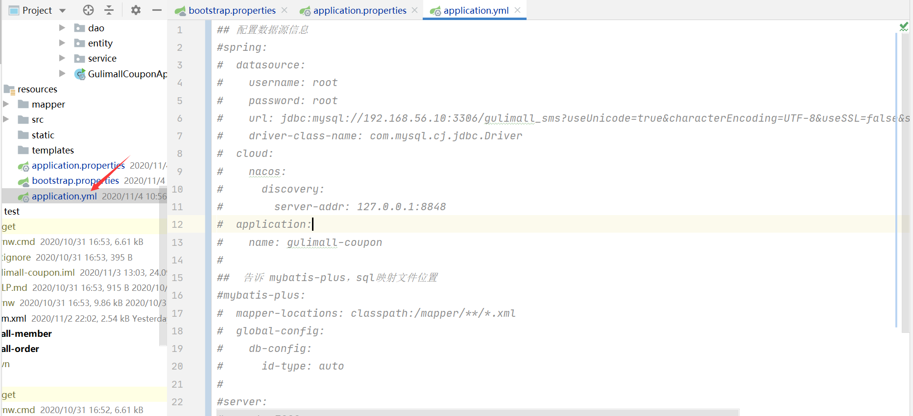

# P25	分布式组件-SpringCloud Alibaba-Nacos配置中心-加载多个配置集

*本节以gulimall-coupon为例*

同时加载多个配置集

1. 微服务配置任何信息，任何配置文件都可以放在配置中心中

2. 需要在bootstrap.properties说明加载配置中心的哪些配置文件即可

   ```properties
   #nacos配置数据源
   spring.cloud.nacos.config.extension-configs[0].data-id=datasource.yml
   spring.cloud.nacos.config.extension-configs[0].group=dev
   spring.cloud.nacos.config.extension-configs[0].refresh=true
   
   #nacos配置mybatis
   spring.cloud.nacos.config.extension-configs[1].data-id=mybatis.yml
   spring.cloud.nacos.config.extension-configs[1].group=dev
   spring.cloud.nacos.config.extension-configs[1].refresh=true
   
   #nacos配置其他信息
   spring.cloud.nacos.config.extension-configs[2].data-id=other.yml
   spring.cloud.nacos.config.extension-configs[2].group=dev
   spring.cloud.nacos.config.extension-configs[2].refresh=true
   ```

3. @Value、@ConfigurationProperties...

   1. 以前SpringBoot任何方法从配置文件中获取值，都可以使用。

   2. 配置中心有的优先使用配置中心的

      最终的bootstrap.properties文件如下：

   ```properties
   #默认的一个文件，且优先加载此文件
   #nacos配置中心
   spring.cloud.nacos.config.server-addr=127.0.0.1:8848
   spring.application.name=gulimall-coupon
   
   #指定使用的命名空间
   spring.cloud.nacos.config.namespace=fc705eae-391c-4fea-bff9-90c97963923f
   
   #只要指定了命名空间，且有默认的gulimall-coupon.properties文件，默认优先加载nacos配置中的gulimall-coupon.properties文件做value是值映射，可以通过指定group分组加载指定的gulimall-coupon.properties文件
   spring.cloud.nacos.config.group=dev
   
   #nacos配置数据源
   spring.cloud.nacos.config.extension-configs[0].data-id=datasource.yml
   spring.cloud.nacos.config.extension-configs[0].group=dev
   spring.cloud.nacos.config.extension-configs[0].refresh=true
   
   #nacos配置mybatis
   spring.cloud.nacos.config.extension-configs[1].data-id=mybatis.yml
   spring.cloud.nacos.config.extension-configs[1].group=dev
   spring.cloud.nacos.config.extension-configs[1].refresh=true
   
   #nacos配置其他信息
   spring.cloud.nacos.config.extension-configs[2].data-id=other.yml
   spring.cloud.nacos.config.extension-configs[2].group=dev
   spring.cloud.nacos.config.extension-configs[2].refresh=true
   ```


1. 在nacos上创建配置文件如下：这样原本在IDEA中application配置信息都在nacos中配置完成，下一步启用就可以了，最终nacos配置信息如下
2. 启用nacos的配置信息，如下图：
3. 启用之后，即使注释掉原来的application.properties服务也可以正常运行
4. 测试，访问数据（如果失败说明，nacos的配置文件没有生效）