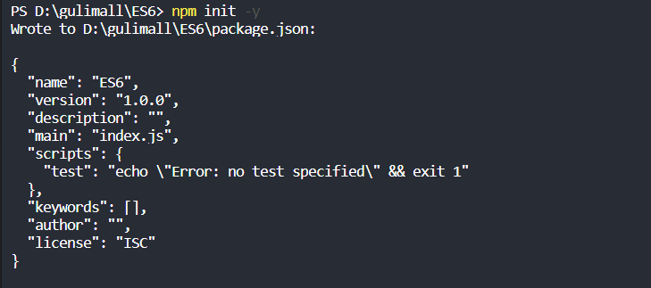

# P36 前端基础-ES6 Vue介绍&HelloWorld

四、Vue
1、MVVM思想

- M:即Model,模型，包括数据和一些基本操作
- V:即View,祝图，页面渲染结果
- VM:即View-Model,模型与视图间的双向操作（无需开发人员干涉）

在MWM之前，开发人员从后端获取需要的数据模型，然后要通过DOM操作Model渲染到View中。而后当用户操作视图，我们还需要通过DOM获取View中的数据，然后同步到Model中。而MVVM中的VM要做的事情就是把DOM操作完全封装起来，开发人员不用再关心Model和View之间是如何互相影响的：

- 只要我们Model发生了改变，View上自然就会表现出来。
- 当用户修改了View,Model中的数据也会跟着改变。

把开发人员从繁琐的DOM操作中解放出来，把关注点放在如何操作Model上。

2、vue简介
vue(读音/vju:/,类似于view)是一套用于构建用户界面的渐进式框架。与其它大型框架不同的是,vue被设计为可以自底向上逐层应用。vue的核心库只关注视图层,不仅易于上手,还便于与第三方库或既有项目整合。另一方面,当与现代化的工具链以及各种支持类库结合使用时,Vue也完全能够为复杂的单页应用提供驱动。

官网:https://cn.vuejs.org/
参考: https://cn.vuejs.org/v2/guide/
Git地址:https://github.com/vuejs/vue
尤雨溪,Vue创作者, Vue Technology创始人,致力于vue的研究开发。

- 初始化（npm管理项目）

- 命令

  ```bash
  npm init -y
  ```




- 安装vue

- 代码

  ```bash
  npm install vue	
  ```


- 编写代码进行测试

- ```html
  <!DOCTYPE html>
  <html>
  	<head>
  		<meta charset="utf-8">
  		<title></title>
  	</head>
  	<body>
  
  <!--  引入vue依赖-->
  		<script src="./node_modules/vue/dist/vue.js"></script>
  
  <!-- 通过vue实例获取属性值 -->
  		<div id="coolboy">
  			<h2>{{name}} is a very cool boy!</h2>
  		</div>
  
  		<script>
  			// 声明式渲染，创建vue对象，并通过绑定id，对div进行管理
  			let vm = new Vue({
  				el: "#coolboy",
  				data: {
  					name: "张三"
  				},
  			});
  		</script>
  
  	</body>
  </html>
  
  ```

  效果如图所示：

在控制台，通过操控vue实例对象可以获取属性值，或者更改属性值