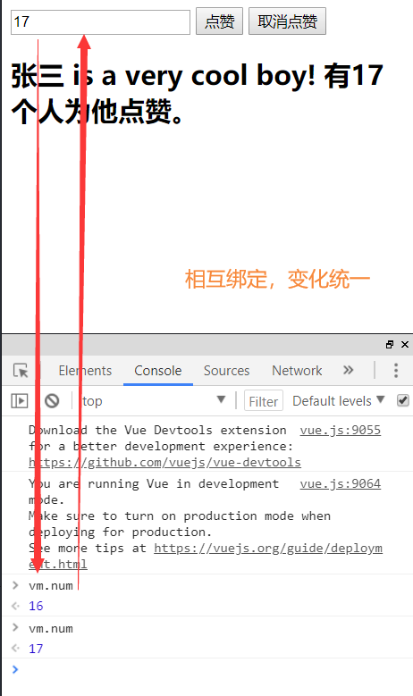

# P37 前端基础-Vue 基本语法&插件安装

##### 插件安装（其中HbuiX有代码提示，所以没用VS，至于浏览器插件，谷歌插件可能难整，但是火狐很容安装）

- Vue 2 Snippets（visual studio code）
- Vue.js devtools (谷歌浏览器)

基本语法：

```html
<!DOCTYPE html>
<html>
	<head>
		<meta charset="utf-8">
		<title></title>
	</head>
	<body>

<!--  引入vue依赖-->
		<script src="./node_modules/vue/dist/vue.js"></script>

<!-- 通过vue实例获取属性值(视图) -->
		<div id="coolboy">
			<input type="text" v-model="num" />
			<button v-on:click="num++">点赞</button>
			<button v-on:click="cancle">取消点赞</button>
			<h2>{{name}} is a very cool boy! 有{{num}}个人为他点赞。</h2>
		</div>

		<script>
			// 声明式渲染，创建vue对象，并通过绑定id，对div进行管理（模型）
			let vm = new Vue({
				el: "#coolboy", //绑定元素
				data: {			//封装数据
					name: "张三",
					num: 1
				},
				methods:{		//封装方法
					cancle(){
						this.num--;
					}
				}
			});
			// 双向绑定，模型变化，视图变化。反之亦然<input type="text" v-model="num" />
			
			// 事件处理<button 	<button v-on:click="num++">点赞</button>点击按钮，num加一
			// v-xx：指令
			
			// 创建vue实例,关联页面的模板,将自己的数据(data)渲染到关联的模板,响应式的;
			// 指令简化一些对dom的操作，如点赞按钮
			// 声明方法做更复杂的操作，methods可以封装方法，如声明取消点赞方法及使用
			
			
		</script>

	</body>
</html>

```

最终效果图如下：

