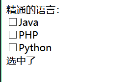

# P38 前端基础-Vue-指令 单向绑定&双向绑定

1、插值表达式
1)、花括号
格式：{{表达式}}
说明：

- 该表达式支持JS语法，可以调用js内置函数（必须有返回值）
- 表达式必须有返回结果。例如1+1,没有结果的表达式不允许使用，如：leta=1+1;·可以直接获取Vue实例中定义的数据或函数

2)、插值闪烁
使用{{}}方式在网速较慢时会出现问题。在数据未加载完成时，页面会显示出原始的{{}},加载完毕后才显示正确数据，我们称为插值闪烁。
我们将网速调慢一些，然后刷新页面，试试看刚才的案例：


加载完成之后：



##### 单向绑定：

###### 目录结构：

###### 

v-text，v-html文件：

```html
<!DOCTYPE html>
<html>
	<head>
		<meta charset="utf-8">
		<title></title>

	</head>
	<body>
		<!-- <script src="../node_modules/vue/dist/vue.js"></script> -->
		<script src="../js/vue.js"></script>

		<div id="app">

			{{msg}},{{1+3}},{{Hello()}}
			<br />
			<span v-html="msg"></span>
			<br />
			<span v-text="msg"></span>

		</div>


		<script>
			new Vue({
				el: "#app",
				data: {
					msg: "<h1>Hello</h1>"
				},
				methods: {
					Hello() {
						return "helloWorld"

					}
				}
			})
		</script>

	</body>
</html>

```

绑定标签：

*这里绑定是单向的，即在页面中修改了属性值，控制台中的值并不会发生改变，但是反之，页面的属性值会一起变化*

```html
<!DOCTYPE html>
<html>
	<head>
		<meta charset="utf-8">
		<title></title>
	</head>
	<body>
		<script src="../js/vue.js"></script>


		<!-- 给html标签的属性绑定 -->
		<div id="app">

			<a v-bind:href="link">gogogo</a>
			<!-- 绑定其他标签class，style {class名}:加上？-->
			<span v-bind:class="{active:isActive,'text-danger':hasEroor}" :style="{color:color1,fontSize: size}">你好</span>

		</div>

		<script>
			let vm = new Vue({
				el: "#app",
				data: {
					link: "http://www.baidu.com",
					isActive: true,
					hasEroor: true,
					color1: 'green',
					size: '33px'

				}
			})
		</script>

	</body>
</html>
```


#### 双向绑定：

###### 实现：

*双向绑定*

```html
<!DOCTYPE html>
<html>
	<head>
		<meta charset="utf-8">
		<title></title>
	</head>
	<body>
		<!-- 表单项，自定义组件 -->
		<div id="app">
			精通的语言：<br />
			<input type="checkbox" v-model="language" value="Java" />Java<br />
			<input type="checkbox" v-model="language" value="PHP" />PHP<br />
			<input type="checkbox" v-model="language" value="Python" />Python<br />
			选中了{{language.join(",")}}
		</div>

		<script src="../js/vue.js"></script>

		<script>
			let vm = new Vue({
				el: "#app",
				data: {
					language: []
				}
			})
		</script>
	</body>
</html>
```


###### 效果如下：


调用属性值language：

