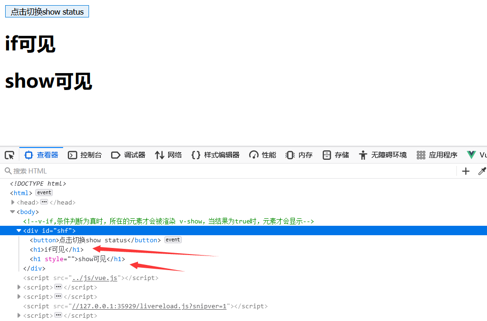
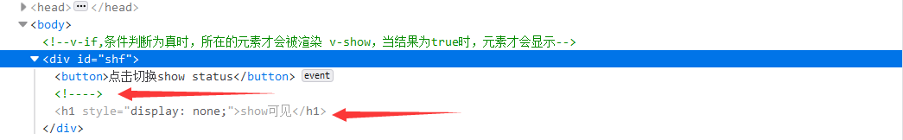
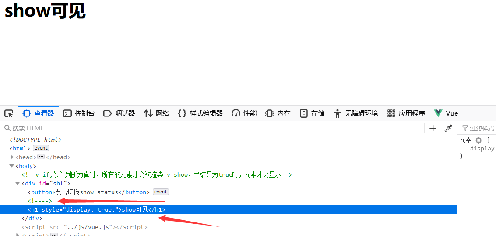
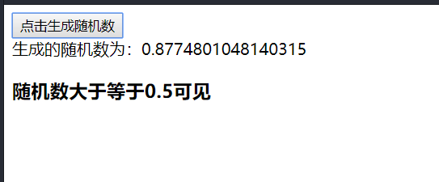

# P39 前端基础-Vue指令 v-on，v-for，v-if

*事件修饰符*

> 在事件处理程序中调用 event.preventDefault()或 event.stopPropagation()是非常常见的需求。尽管我们可以在方法中轻松实现这点，但更好的方式是：方法只有纯粹的数据逻辑，而不是去处理DOM事件细节。
> 为了解决这个问题，vue.js为v-on提供了事件修饰符。修饰符是由点开头的指令后缀来表示的。
> stop:阻止事件冒泡到父元素
> prevent:阻止默认事件发生
> capture:使用事件捕获模式
> self:只有元素自身触发事件才执行。（冒泡或捕获的都不执行）
> once:只执行一次

按键修饰符

> 按键修饰符
> 在监听键盘事件时，我们经常需要检查常见的键值。Vue允许为 v-on在监听键盘事件时添，按键码可能已经弃用
> 加按键修饰符：
> <!-- 只有在 `key` 是 `Enter` 时调用 `vm.submit()` -->
> <input v-on:keyup.enter="submit">
>
> 记住所有的'keyCode'比较困难，所以Vue为最常用的按键提供了别名：
> <!--同上-->
> <input V-on:keyup.enter="submit">
> <!--缩写语法-->
> <input @keyup.enter="submit">
>
> 为了在必要的情况下支持旧浏览器，Vue 提供了绝大多数常用的按键码的别名：
>
> - `.enter`
> - `.tab`
> - `.delete` (捕获“删除”和“退格”键)
> - `.esc`
> - `.space`
> - `.up`
> - `.down`
> - `.left`
> - `.right`
>
> 

```html
<!DOCTYPE html>
<html>
	<head>
		<meta charset="utf-8">
		<title></title>
	</head>
	<body>
		<script src="js/vue.js"></script>
        
        <!-- 事件修饰符 -->
		<div id="von1">
			<h1>点赞数：{{num}}</h1>
			<button v-on:click="num++">点赞</button>
			<button v-on:click="canale">取消</button>


			<!-- once只执行一次,再次点击就不会执行 -->
			<div style="border: 1px solid red;padding: 20px;" @click.once="hello">
				大div
				<br />
				<!-- @click.stop事件发生以后不要冒泡传到上面 -->
				<div style="border: 1px solid blue;padding: 20px;" @click.stop="hello">
					小div
					<br />
					<!-- prevent组织当前事件，并执行等号后面的指定事件，在这里就是禁止跳转到百度，并执行cancle方法 -->
					<a href="http://www.baidu.com" v-on:click.prevent="canale">baidu</a>
				</div>
			</div>

			<!-- 按键修饰符 -->
			<!-- v-on:keyup="" 简写为@keyup.up/down/left/right=""方向键上下左右  下面实例一次实现-->
			<!-- v-on:click.ctrl.left/right="num+=100"组合键ctrl+鼠标左键/右键 简写为  @click.ctrl.left="num+=100"-->

			<input type="text" v-model="num" v-on:click.ctrl.left="num+=100" @keyup.up="num++" @keyup.down="num--" @keyup.left="num-=10"
			 @keyup.right="num+=10" @click.ctrl.right="num-=100" />


		</div>


		<script>
			let vm = new Vue({
				el: "#von1",

				data: {
					num: 0,
					name: Vue.js
				},
				methods: {
					canale() {
						this.num--
					},
					hello() {
						alert("点击了")
					}
				}
			})
		</script>


	</body>
</html>

```

#### v-for用法（类似thymeleaf模板引擎）

###### 代码：

```html
<!DOCTYPE html>
<html>
	<head>
		<meta charset="utf-8">
		<title></title>
	</head>
	<body>
		<script src="../js/vue.js"></script>

		<div id="vfor">
			<ul>
				<!-- 遍历数组，（对象，索引） ，必须有第一个参数，其他的可选-->
				<li v-for="(user,index) in users" :key="user.name">
					当前索引:{{index}}--{{user.name}}==>{{user.gender}}==>{{user.age}}<br />

					<!-- 遍历对象信息：三个个参数(value，key，index)，第一个必须有，其他可选 -->
					<span v-for="(value,key,index) in user">对象索引值{{index}}>{{key}}:{{value}}=></span>
				</li>
			</ul>

			<ul v-for="(num,i) in numbers" :key="i">
				{{num}}
			</ul>
		</div>

		<script>
			let vm = new Vue({
				el: "#vfor",
				data: {
					users: [{
							name: '范冰冰',
							gender: "女",
							age: "21"
						},
						{
							name: '柳岩',
							gender: "女",
							age: "21"
						},
						{
							name: '刘亦菲',
							gender: "女",
							age: "21"
						},
						{
							name: '古力娜扎',
							gender: "女",
							age: "21"
						},
						{
							name: '张三',
							gender: "男",
							age: "21"
						},
					],
					numbers: [2, 3, 4, 5, 1, 3],
				}

			})
		</script>

	</body>
</html>

```


#### show-if对比

###### 代码：

```html
<!DOCTYPE html>
<html>
	<head>
		<meta charset="utf-8">
		<title></title>
	</head>
	<body>
		<!-- 
		v-if,条件判断为真时，所在的元素才会被渲染
		v-show，当结果为true时，元素才会显示
		 -->
		<div id="shf">
			<button v-on:click="show=!show">点击切换show status</button>
			<h1 v-if="show">if可见</h1>
			<h1 v-show="show">show可见</h1>
		</div>

		<script src="../js/vue.js"></script>

		<script>
			let vm = new Vue({
				el: "#shf",
				data: {
					show: true
				}
			})
		</script>

	</body>
</html>

```

###### 区别在于，show只是隐藏了（display=none），但是if是彻底不可见



当设置display=true时，show又可见

#### v-else-if

```html
<!DOCTYPE html>
<html>
	<head>
		<meta charset="utf-8">
		<title></title>
	</head>
	<body>

		<div id="elif">
			<button @click="random">点击生成随机数</button>
			<br />
			<span>生成的随机数为：{{rdm}}</span>

			<h3 v-if="rmd>=0.75">
				随机数大于等于0.75可见
			</h3>

			<h3 v-else-if="rdm>=0.5">
				随机数大于等于0.5可见
			</h3>
			<h3 v-else-if="rdm>=0.25">
				随机数大于等于0.25可见
			</h3>
			<h3 v-else>
				随机数小于0.25可见
			</h3>

		</div>
		<script src="../node_modules/vue/dist/vue.js"></script>
		<script>
			let vm = new Vue({
				el: "#elif",
				data: {
					rdm: 1
				},
				methods: {
					random() {
						this.rdm = Math.random();
					}
				}
			})
		</script>
	</body>
</html>

```

###### 效果如图：

