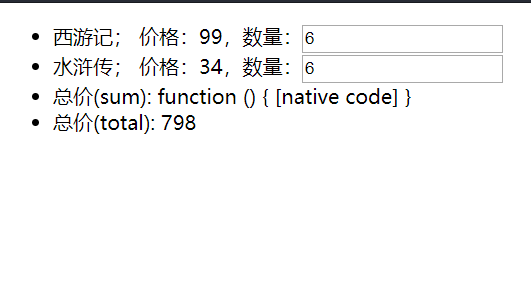
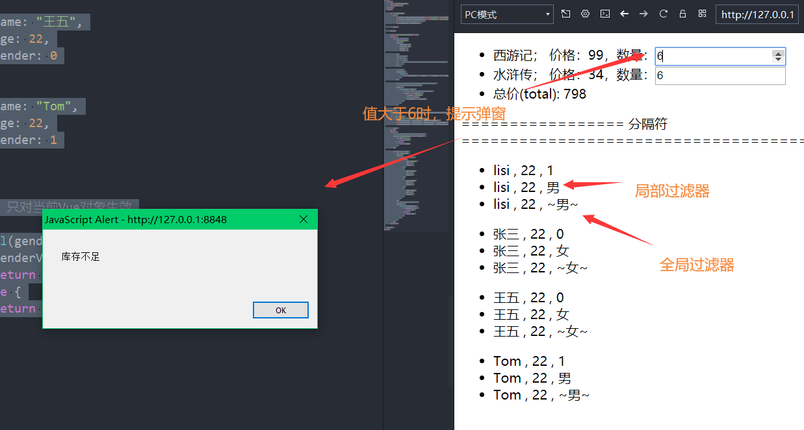

# P40 前端基础-Vue-计算属性和侦听器

实时计算

```html
<!DOCTYPE html>
<html>
	<head>
		<meta charset="utf-8">
		<title></title>
	</head>
	<body>
		
		<div id="cpulis">
			<ul>
				<li>西游记； 价格：{{xyjPrice}}，数量：<input type="number" v-model="xyxNum" /> </li>
				<li>水浒传； 价格：{{shzPrice}}，数量：<input type="number"  v-model="shzNum"/> </li>
				<li>总价(sum): {{sum}}</li>
				<li>总价(total): {{total}}</li>
			</ul>
			
		</div>
		
		<script src="./js/vue.js"></script>
		<script>
			let vm=new Vue({
				el:"#cpulis",
				data:{
					xyjPrice:99,
					shzPrice:34,
					xyxNum:1,
					shzNum:1
				},
				methods:{
					sum(){
					return this.xyxNum*this.xyxNum+this.shzNum*this.shzPrice;
					}
				},
				computed:{
					total(){
						return totalPrice=this.xyxNum*this.xyjPrice+this.shzNum*this.shzPrice;
					}
				}
			})
		</script>
	</body>
</html>

```

可以看到自定义的methos方法在这里显示都出错，不能计算

侦听器和过滤器：

```html
<!DOCTYPE html>
<html>
	<head>
		<meta charset="utf-8">
		<title></title>
	</head>
	<body>

		<div id="cpulis">
			<ul>
				<li>西游记； 价格：{{xyjPrice}}，数量：<input type="number" v-model="xyxNum" /> </li>
				<li>水浒传； 价格：{{shzPrice}}，数量：<input type="number" v-model="shzNum" /> </li>
				<!-- <li>总价(sum): {{sum}}</li> -->
				<li>总价(total): {{total}}</li>

			</ul>

		</div>

		<script src="./js/vue.js"></script>
		<script>
			let vm = new Vue({
				el: "#cpulis",
				data: {
					xyjPrice: 99,
					shzPrice: 34,
					xyxNum: 1,
					shzNum: 6,

				},
				//自定义函数方法
				// methods:{
				// 	sum(){
				// 	return this.xyxNum*this.xyxNum+this.shzNum*this.shzPrice;
				// 	}
				// },

				// 实时计算
				computed: {
					total() {
						return totalPrice = this.xyxNum * this.xyjPrice + this.shzNum * this.shzPrice;
					}
				},

				// 侦听器使用关键字watch，里面定义方法函数，监听什么就以什么命名
				// 比如监听xyxNum，就以xyxNum为函数名
				watch: {
					xyxNum(newV, oldV) {
						// alert("oldV:"+oldV+"==>newV:"+newV)
						if (newV > this.shzNum) {
							this.mesg = "库存不足"
							alert(this.mesg)
							this.xyxNum = this.shzNum
						}
					}
				}

			})
		</script>
		================= 分隔符=====================================================
		<!-- 过滤器 -->
		<div id="userfil">
			<ul v-for="user in users" :key="user.name">
				<li>{{user.name}} , {{user.age}} , {{user.gender}}</li>
				<li>{{user.name}} , {{user.age}} , {{user.gender | uGenderfil}}</li>
				<li>{{user.name}} , {{user.age}} , {{user.gender | gloFilter}}</li>

			</ul>
		</div>
		<script>
			// 全局过滤器，全局生效,必须卸载前面，写在后面用不到
			Vue.filter("gloFilter", function(gloV) {
				if (gloV == 1) {
					return "~男~"
				} else {
					return "~女~"
				}
			})

			let vm1 = new Vue({
				el: "#userfil",
				data: {
					// 1代表男生，0代表女生
					users: [{
							name: "lisi",
							age: 22,
							gender: 1
						},
						{
							name: "张三",
							age: 22,
							gender: 0
						},
						{
							name: "王五",
							age: 22,
							gender: 0
						},
						{
							name: "Tom",
							age: 22,
							gender: 1
						}
					]
				},
				// 局部过滤器，只对当前Vue对象生效
				filters: {
					uGenderfil(genderV) {
						if (genderV == 1) {
							return "男"
						} else {
							return "女"
						}
					}
				}
			})
		</script>

	</body>
</html>

```

