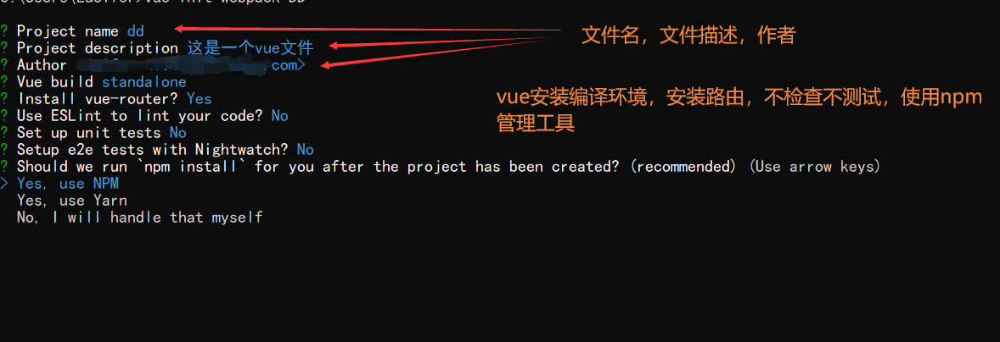

# P44 前端基础-Vue 使用vue的脚手架进行模块化开发

1. npm install webpack -g

   全局安装webpack

2. npm install -g @Vue/cli-init

   全局安装vue脚手架

3. 初始化vue项目：

   vue init webpack appname

   > 这里启动下载的时候会有提示安装相关功能组件，根据需求安装即可

   vue脚手架使用webpack模板初始化一个appname项目

4. 启动vue项目：

   1. 切换到vue-demo文件夹中
   2. npm run dev

5. > 文件夹介绍
   >
   > build——webpack打包相关的工具
   >
   > config——相关的配置信息
   >
   > node_modules——node相关依赖
   >
   > src——代码文件夹
   >
   > static——静态资源文件夹，用来存放图片，字体等内容
   >
   > .bablerc——用来存放语法转义文件
   >
   > package-lock.json——npm依赖包的一些详细信息
   >
   > package.json——npm依赖包的一些信息

   

手写一个路由实例：

- ​	编写components/hello.vue文件

```vue

<template>
  <h1>hello,你好,{{name}}</h1>
</template>

<script>
  export default{
    data(){
      return {
        name: '张三'
      }
    }
  }
</script>

<style>
</style>

```

- ​	编写router/index.js路由规则

  ```js
  import Vue from 'vue'
  import Router from 'vue-router'
  import HelloWorld from '@/components/HelloWorld'
  import hello from '@/components/hello'
  Vue.use(Router)
  
  export default new Router({
    routes: [
      {
        path: '/',
        name: 'HelloWorld',
        component: HelloWorld
      },
      {
        path: '/hello',
        name: 'hello',
        component: hello
      }
    ]
  })
  
  ```

  - 编写App.vue文件

    ```vue
    <template>
      <div id="app">
        
    
        <!-- 去hello -->
        <router-link to="/hello">去hello</router-link>
        <router-link to="/">去首页</router-link>
        <router-view/>
      </div>
    </template>
    
    ```

    

  - 启动测试即可