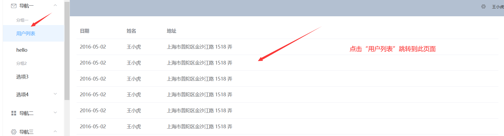
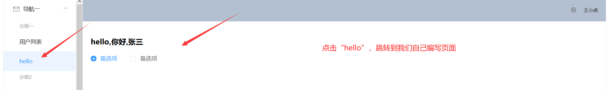

# P44 前端基础-Vue-整合ElementUI快速开发

这个没什么要讲的，直接看[官网链接](https://element.eleme.cn/#/zh-CN/component/installation)吧

MyTable

```vue
<template>
  <div>
      <el-table :data="tableData">
        <el-table-column prop="date" label="日期" width="140">
        </el-table-column>
        <el-table-column prop="name" label="姓名" width="120">
        </el-table-column>
        <el-table-column prop="address" label="地址">
        </el-table-column>
      </el-table>
  </div>
</template>

<script>
 export default {
   data() {
     const item = {
       date: '2016-05-02',
       name: '王小虎',
       address: '上海市普陀区金沙江路 1518 弄'
     };
     return {
       tableData: Array(20).fill(item)
     }
   }
 };
</script>

<style>
</style>

```

router下的index

```js
import Vue from 'vue'
import Router from 'vue-router'
import HelloWorld from '@/components/HelloWorld'
import hello from '@/components/hello'
import MyTable from '@/components/MyTable'

Vue.use(Router)

export default new Router({
  routes: [
    {
      path: '/',
      name: 'HelloWorld',
      component: HelloWorld
    },
    {
      path: '/hello',
      name: 'hello',
      component: hello
    },
    {
      path: '/table',
      name: 'MyTable',
      component: MyTable
    }
  ]
})

```

App.vue

```vue
<template>
  <el-container style="height: 500px; border: 1px solid #eee">
    <el-aside width="200px" style="background-color: rgb(238, 241, 246)">
      <el-menu :default-openeds="['1', '3']" router=true>
        <el-submenu index="1">
          <template slot="title"><i class="el-icon-message"></i>导航一</template>
          <el-menu-item-group>
            <template slot="title">分组一</template>
            <el-menu-item index="/table">用户列表</el-menu-item>
            <el-menu-item index="/hello">hello</el-menu-item>
          </el-menu-item-group>
          <el-menu-item-group title="分组2">
            <el-menu-item index="1-3">选项3</el-menu-item>
          </el-menu-item-group>
          <el-submenu index="1-4">
            <template slot="title">选项4</template>
            <el-menu-item index="1-4-1">选项4-1</el-menu-item>
          </el-submenu>
        </el-submenu>
        <el-submenu index="2">
          <template slot="title"><i class="el-icon-menu"></i>导航二</template>
          <el-menu-item-group>
            <template slot="title">分组一</template>
            <el-menu-item index="2-1">选项1</el-menu-item>
            <el-menu-item index="2-2">选项2</el-menu-item>
          </el-menu-item-group>
          <el-menu-item-group title="分组2">
            <el-menu-item index="2-3">选项3</el-menu-item>
          </el-menu-item-group>
          <el-submenu index="2-4">
            <template slot="title">选项4</template>
            <el-menu-item index="2-4-1">选项4-1</el-menu-item>
          </el-submenu>
        </el-submenu>
        <el-submenu index="3">
          <template slot="title"><i class="el-icon-setting"></i>导航三</template>
          <el-menu-item-group>
            <template slot="title">分组一</template>
            <el-menu-item index="3-1">选项1</el-menu-item>
            <el-menu-item index="3-2">选项2</el-menu-item>
          </el-menu-item-group>
          <el-menu-item-group title="分组2">
            <el-menu-item index="3-3">选项3</el-menu-item>
          </el-menu-item-group>
          <el-submenu index="3-4">
            <template slot="title">选项4</template>
            <el-menu-item index="3-4-1">选项4-1</el-menu-item>
          </el-submenu>
        </el-submenu>
      </el-menu>
    </el-aside>

    <el-container>
      <el-header style="text-align: right; font-size: 12px">
        <el-dropdown>
          <i class="el-icon-setting" style="margin-right: 15px"></i>
          <el-dropdown-menu slot="dropdown">
            <el-dropdown-item>查看</el-dropdown-item>
            <el-dropdown-item>新增</el-dropdown-item>
            <el-dropdown-item>删除</el-dropdown-item>
          </el-dropdown-menu>
        </el-dropdown>
        <span>王小虎</span>
      </el-header>
     
      <el-main>
        <router-view></router-view>
      </el-main>

    </el-container>
  </el-container>
</template>
<style>
  .el-header {
    background-color: #B3C0D1;
    color: #333;
    line-height: 60px;
  }

  .el-aside {
    color: #333;
  }
</style>

<script>

</script>

```

最终效果如图：

