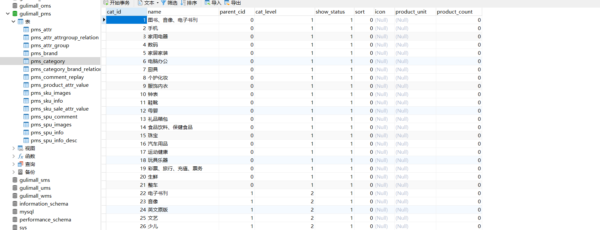
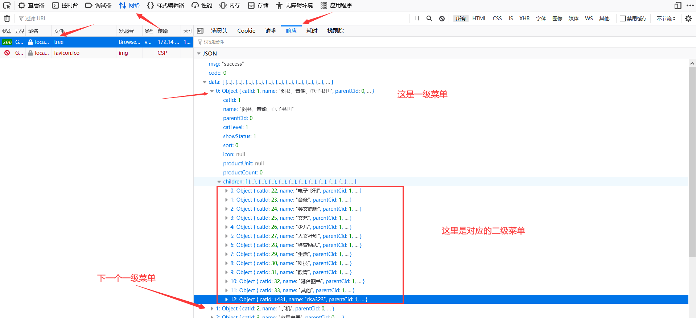

# P45 商城服务-API三级分类-查询递归树形结构数据获取

首先建表，使用建表语句，在Navicat中运行，最好是复制过去运行，而不是直接运行sql文件。（pms_catelog.sql文件可在同图片路径文件夹下获得）



在逆向生成的controller中，有一个CategoryController类，在此类中添加一个分类的方法

```java
@RestController
@RequestMapping("product/category")
public class CategoryController {
    @Autowired
    private CategoryService categoryService;

    /**
     * 查出所有分类以及子分类，以树形结构组装起来
     */
    @RequestMapping("/list/tree")
    public R list(){
       List<CategoryEntity>entities= categoryService.listWithTree();
        return R.ok().put("data", entities);
    }


```

去service文件下完善categoryService接口方法

CategoryService

```java
public interface CategoryService extends IService<CategoryEntity> {

    PageUtils queryPage(Map<String, Object> params);

    List<CategoryEntity> listWithTree();
}

```

将CategoryService实现，编写CategoryServiceImpl文件

```java
@Override
    public List<CategoryEntity> listWithTree() {
//        查出所有分类

        List<CategoryEntity> entities = baseMapper.selectList(null);

//        组装成父子的树形结构
//        一级菜单
        List<CategoryEntity> level1Menu=entities.stream().filter((categoryEntity)->{
            return categoryEntity.getParentCid()==0;
        }).map((menu)->{
            menu.setChildren(getChildren(menu,entities));
            return menu;
        }).sorted((menu1,menu2)->{
            return (menu1.getSort()==null?0:menu1.getSort())-(menu2.getSort()==null?0:menu2.getSort());
        }).collect(Collectors.toList());

        return level1Menu;
    }


//    递归查找所有菜单的子菜单
    private List<CategoryEntity> getChildren(CategoryEntity root,List<CategoryEntity> all){
        List<CategoryEntity> childern = all.stream().filter((categoryEntity) -> {
            return categoryEntity.getParentCid() == root.getCatId();
        }).map((categoryEntity)->{
//            找子菜单
            categoryEntity.setChildren(getChildren(categoryEntity,all));
            return categoryEntity;
        }).sorted((menu1,menu2)->{
//            排序
            return (menu1.getSort()==null?0:menu1.getSort())-(menu2.getSort()==null?0:menu2.getSort());
        }).collect(Collectors.toList());
        return childern;
    }

```

在上面的实现中我们不仅查找了一级菜单，还编写了getChildren()查找子菜单方法以及使用递归的方法把对应的父子菜单都查找返回显示。

所以我们还要在实体类中添加Children属性，尽管不用显示但是在执行逻辑上需要它。编写entity下的CategoryEntity文件，添加如下

```java
//	子分类
	@TableField(exist = false) //mybatis-plus注解，表示当前字段不是数据库中的字段，但在项目中必须使用
	private List<CategoryEntity> children;
```

这样我们就完成了三级分类的逻辑部分，最终成功效果如下，访问

http://localhost:10000/product/category/list/tree

进行查看。



