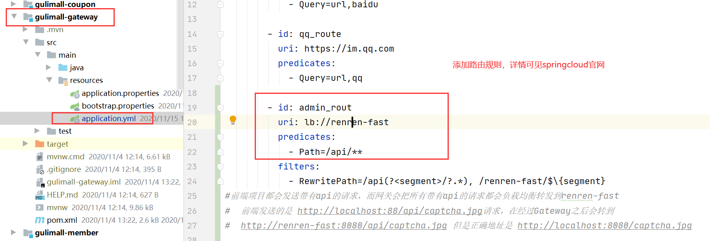

# P46 商品服务 API-三级分类 配置网关路由与路径重写

**准备：**

> 启动nacos服务
>
> 启动虚拟机与mysql数据库
>
> 启动前端项目renren-fast-vue
>
> 启动后台管理项目renren-fast

**报错：某某被端口占用(以8080端口为例)**

打开cmd命令窗口，输入以下命令

netstat -ano|findstr "8080"


找到pid后，按住ctrl和alt键与小键盘的小数点==.==	调出任务管理器

**进入renren-fast-vue页面：**

新增菜单栏


所以我们要启动product模块，连接pms数据库，同时编写前端页面


所以我们自己创建的product-category也要按照既定的规则添加前端文件


编写文件（参照[elementui](https://element.eleme.cn/#/zh-CN/component/tree)，以及其他文件的methods方法）

```vue
<template>
  <el-tree :data="data" :props="defaultProps" @node-click="handleNodeClick"></el-tree>
</template>

<script>
  export default {
    data() {
      return {
        data: [],

      };
    },

    methods: {
      handleNodeClick(data) {
        console.log(data);
      },

      getMenus(){
        this.$http({
          url: this.$http.adornUrl('/product/category/list/tree'),
          method: 'get',
        }).then((data) => {
          console.log("successly get data...",data)
        })

      }

    },

    created() {
      this.getMenus()
    }

  };
</script>

<style>
</style>
```

但是这样并不能获取到我们想要的三级分类菜单数据原因就是路径问题

就算我们统一了URL地址，但是我们不是每次都使用10000端口，可能会动态的调整（负载均衡），所以我们把发送到product模块10000端口的所有请求都转给gateway，让网关动态使用路由地址（通过查找，输入url找到baseUrl）


刷新页面之后发现需要重新登录，且没有验证码，原因是直接给网关发送了验证码请求，但是验证码只在renren-fast中（也就是8080端口）。所以我们要把renren-fast注册到网关中

为renren-fast添加注册依赖，编写pom文件：

```xml
<!--        在dependencies标签体内复制粘贴-->
<!--        服务发现，即注册中心-->
    <dependency>
        <groupId>com.alibaba.cloud</groupId>
        <artifactId>spring-cloud-starter-alibaba-nacos-discovery</artifactId>
    </dependency>

    <!--      配置中心做配置管理-->
    <dependency>
        <groupId>com.alibaba.cloud</groupId>
        <artifactId>spring-cloud-starter-alibaba-nacos-config</artifactId>
    </dependency>
    
<!--        在dependencies标签体外-->
<dependencyManagement>
        <dependencies>
            <dependency>
                <groupId>com.alibaba.cloud</groupId>
                <artifactId>spring-cloud-alibaba-dependencies</artifactId>
                <version>2.2.3.RELEASE</version>
                <type>pom</type>
                <scope>import</scope>
            </dependency>
        </dependencies>
    </dependencyManagement>
    
```

将renren-fast注册到nacos中，修改yml配置文件，加入

```yaml
spring:
  application:
    name: renren-fastcloud:
  cloud:
  	nacos:
      discovery:
        server-addr: 127.0.0.1:8848
```

开发注册服务

此时nacos服务列表中应该有renren-fast服务



*未圈出的filter内容是后面步骤的，在此环节可以忽略*

这里改写好之后仍然不能加载验证码，原因是：

> 前端项目都会发送带有api的请求，而网关会把所有带有api的请求都会负载均衡转发到renren-fast
>
> 前端发送的是 http://localhost:88/api/captcha.jpg请求，在经过Gateway之后会转到
>
> http://renren-fast:8080/api/captcha.jpg 但是正确地址是 http://localhost:8080/captcha.jpg
>
> 所以加载不了验证码。

可以使用springcloud gateway里的RewritePath GatewayFilter Factory进行路径重写。


此时不能加载验证码的问题可以解决了。

