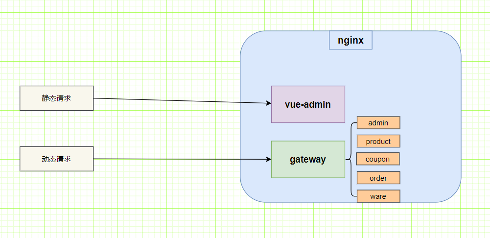
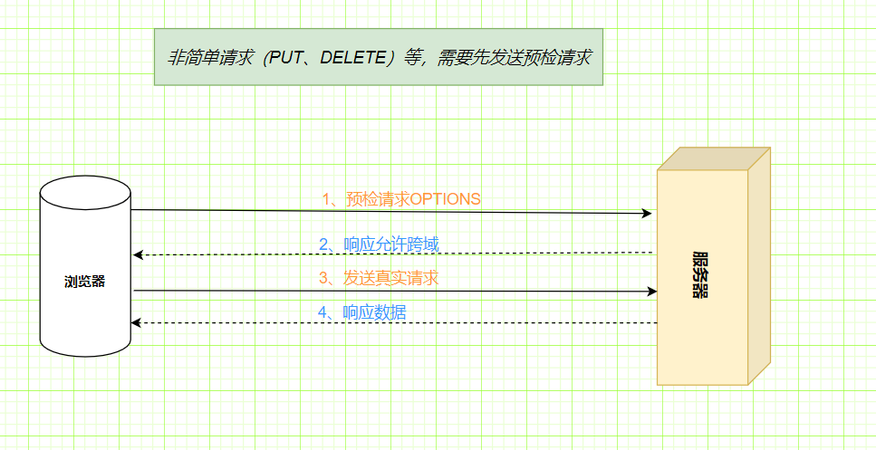
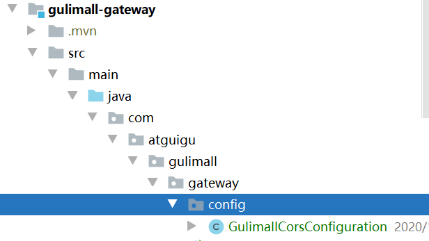
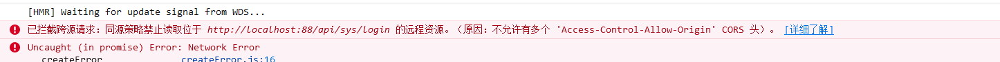
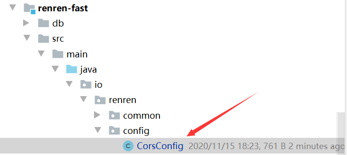
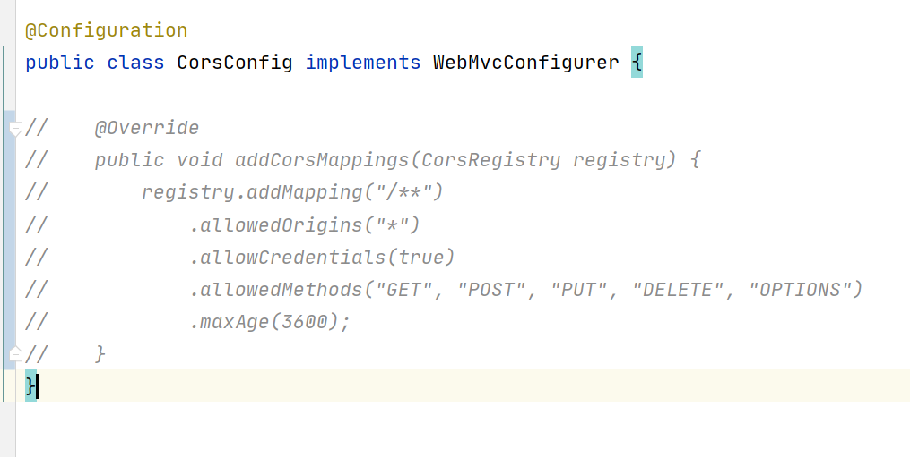

# P47 商品服务 API-三级分类-网关统一配置跨域


==跨域==：指的是浏览器不能执行其他网站的脚本。它是由浏览器的同源策略造成的，是浏览器对iavascript施
加的安全限制。
==同源策略==：是指协议，域名，端口都要相同，其中有一个不同都会产生跨域；

> http(s),域名，端口号必须一致
> http://192.168.xx.xx:8080
> 端口号及以前必须相同，否则就不符合同源策略

**解决跨域（一）使用nginx部署为同一域**



**跨域解决方法（二）配置当次请求允许跨域**

[关于简单请求与非简单请求链接](https://developer.mozilla.org/zh-CN/docs/Web/HTTP/Access_control_CORS#%E4%BB%80%E4%B9%88%E6%83%85%E5%86%B5%E4%B8%8B%E9%9C%80%E8%A6%81_CORS_%EF%BC%9F)可以查看相关信息



1、添加响应头
·Access-Control-Allow-Origin:支持哪些来源的请求跨域
·Access-Control-Allow-Methods:支持哪些方法跨域
·Access-Control-Allow-Credentials:跨域请求默认不包含cookie,设置为true可以包含cookie
·Access-Control-Expose-Headers:跨域请求暴露的字段

> ·CORS请求时，XMLHttpRequest对象的getResponseHeader()方法只能拿到6个基本字段：
>
> Cache-Control、Content-Language、Content-Type、Expires、Last-Modified、Pragma。
> 如果想拿到其他字段，就必须在Access-Control-Expose-Headers里面指定。

·Access-Control-Max-Age:表明该响应的有效时间为多少秒。在有效时间内，浏览器无须为同一请求再次发起预检请求。请注意，浏览器自身维护了一个最大有效时间，如果该首部字段的值超过了最大有效时间，将不会生效。


因为每个服务都有可能会添加响应头，所以可以把配置写在Gateway中。



在GulimallCorsConfiguration中

```java
package com.atguigu.gulimall.gateway.config;

import org.springframework.context.annotation.Bean;
import org.springframework.context.annotation.Configuration;
import org.springframework.web.cors.CorsConfiguration;
import org.springframework.web.cors.reactive.CorsWebFilter;
import org.springframework.web.cors.reactive.UrlBasedCorsConfigurationSource;

@Configuration
public class GulimallCorsConfiguration {

    @Bean
    public CorsWebFilter corsWebFilter(){
        UrlBasedCorsConfigurationSource source = new UrlBasedCorsConfigurationSource();
        CorsConfiguration corsConfiguration=new CorsConfiguration();

              //配置跨域
//        允许所有的响应头
        corsConfiguration.addAllowedHeader("*");
//        允许所有的请求方法
        corsConfiguration.addAllowedMethod("*");
//        允许所有的来源
        corsConfiguration.addAllowedOrigin("*");
//        允许携带cookie
        corsConfiguration.setAllowCredentials(true);


        source.registerCorsConfiguration("/**",corsConfiguration);
        return new CorsWebFilter(source);
    }
}

```

之后启动服务模块进行测试

会发现有报错信息

不允许有多个CORS头，说明除了我们自己的配置之外可能还有其他配置生效！对，没错就是renren-fast



果然存在，将里面的配置代码注释掉即可

最后重新启动一下相关模块即可，再次登录就可以登录进来了