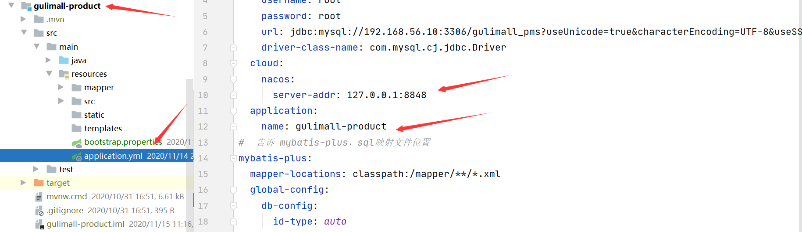
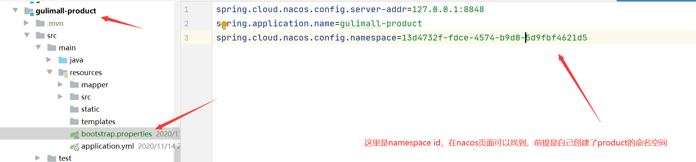

# P48 商品服务-API-三级分类-查询-树形展示三级分类数据

跨域解决了但是仍然获取不到三级分类的数据，原因是


这个地址转给了renren-fast，而不是gulimall-product

因此我们要重新配置路由。

1. 首先将product模块注册到nacos中去：

2. 指定配置中心

3. 然后配置路由规则

4. product模块

   ```properties
   spring.cloud.nacos.config.server-addr=127.0.0.1:8848
   spring.application.name=gulimall-product
   spring.cloud.nacos.config.namespace= 
   #自己的命名空间id
   ```

5. gateway模块

   ```yaml
     - id: admin_rout
       uri: lb://renren-fast
       predicates:
       	- Path=/api/**
       filters:
           - RewritePath=/api(?<segment>/?.*), /renren-fast/$\{segment}
         
   #注意格式对齐！
   ```

此时nacos启动之后如图，有3个服务启动了

再编写前端页面

```vue
<template>

  <el-tree :data="menus" :props="defaultProps" @node-click="handleNodeClick"></el-tree>
</template>

<script>
  export default {
    comments: {},
    props:{},

    data() {
      return {
        menus: [],
        defaultProps: {
          children:"children",
          label:"name"
        }

      };
    },

    methods: {
      handleNodeClick(data) {
        console.log(data);
      },

      getMenus(){
        this.$http({
          url: this.$http.adornUrl('/product/category/list/tree'),
          method: 'get',
        }).then(({data}) => {
          // 注意then里面的data是{data}解构赋值！！！！
          console.log("successly get data...",data.data)
          return this.menus=data.data
        })

      },


    },

    created() {
      this.getMenus()
    }

  };
</script>

<style scoped>
</style>

```

这里then里面的data一定是{data}，解构赋值，如果没有{}会报错

> # Invalid prop: type check failed for prop "data". Expected Array, got Object