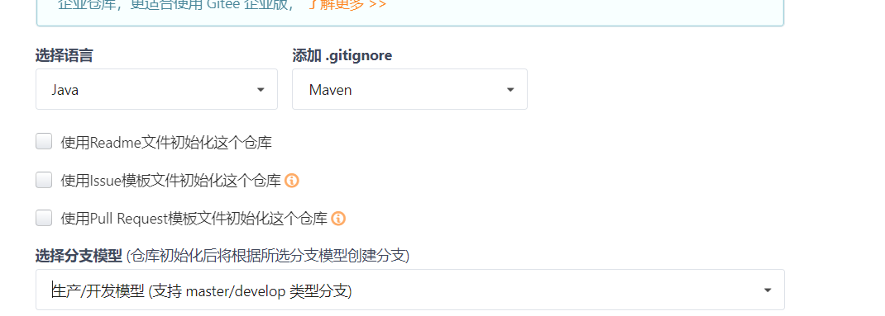
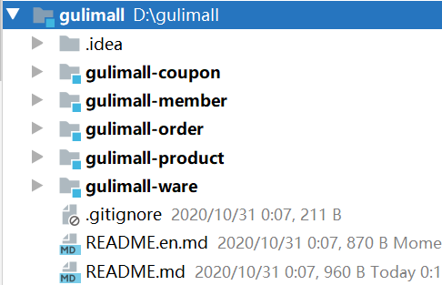
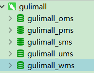
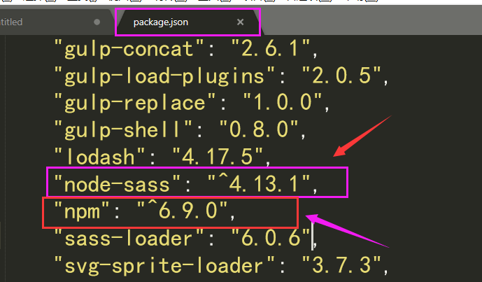

# 谷粒商城环境准备

*P1~P16的内容，由于自己有基础，所以省略很多*

## 介绍：略

## 基础环境搭建：

#### 安装虚拟机vm

#### centos7系统

#### 安装docker（略）

​	开机自启动

​	换源加速

​	安装Mysql5.7和Redis 5.0.x创建实例启动

​	修改mysql的配置

## jdk（略）:

​	1.8及以上

## Maven（略略）：

​	maven版本3.6.1及以上

​	配置阿里云镜像

​	

## IDEA&Vscode（略略略）：

IDEA：

​	lombok

​	MyBatisx

Vscode（个人用的HbuiderX，自己取舍）：

​	auto close

​	auto rename

​	Chinese

​	ESLint

​	Html Css support

​	JavaScript（ES6）

​	 live Server

​	open in browser

​	vetur

​	

## git&码云（略略略）

git：

​	user.name lucifer

​	user.email 1342547278@qq.com

​	ssh连接设置

```bash
ssh-keygen -t rsa -C 1342547278@qq.com
```

​	ssh测试

> ​	ssh -T git@gitee.com

###### 码云：

创建仓库



仓库地址：

https://gitee.com/Nobodise/gulimall.git

git@gitee.com:Nobodise/gulimall.git

​	

#### IDEA 创建项目

目录结构

​	

module创建

> ​	module ->spring initializr ->module info（自己填）->勾选spring web,OpenFeign ->完成

maven聚合

​	将pom添加到maven中

​	编辑pom文件

```pom
 <?xml version="1.0" encoding="UTF-8"?>
<project xmlns="http://maven.apache.org/POM/4.0.0" xmlns:xsi="http://www.w3.org/2001/XMLSchema-instance"
         xsi:schemaLocation="http://maven.apache.org/POM/4.0.0 https://maven.apache.org/xsd/maven-4.0.0.xsd">
    <modelVersion>4.0.0</modelVersion>
    <parent>
        <groupId>org.springframework.boot</groupId>
        <artifactId>spring-boot-starter-parent</artifactId>
        <version>2.3.5.RELEASE</version>
        <relativePath/> <!-- lookup parent from repository -->
    </parent>
    <groupId>com.atguigu.gulimall</groupId>
    <artifactId>gulimall</artifactId>
    <version>0.0.1-SNAPSHOT</version>
    <name>gulimall</name>
    <description>谷粒商城-聚合服务</description>
    <packaging>pom</packaging>

    <modules>
        <module>gulimall-coupon</module>
        <module>gulimall-member</module>
        <module>gulimall-order</module>
        <module>gulimall-product</module>
        <module>gulimall-ware</module>
    </modules>
</project>

```


#### 创建数据库：

- 连接上vm虚拟机

  - 设置mysql和redis开机自启动

    ```bash
    docker update mysql --restart=always
    ```

- 创建出各个微服务的数据库（记得不要直接运行SQL语句，最好是将sql文件复制，粘贴到软件中运行，后面有坑）：

  

- 为每个数据库建表：略


#### 前端（人人开源）

###### 配置后端：

1. 下载renren-fast和renren-fast-vue项目
2. 将renren-fast项目复制到IDEA中
3. 将renren-fast-vue复制到VScode中
4. 建库建表gulimall_admin，运行renren-fast/db/mysql.sql

##### 配置前端：

1. 下载node.js并安装

   1. 使用下面命令查看版本

      ```
      node -v
      ```

2. 配置npm使用淘宝镜像

   1. ```
      npm config set registry http://registry.npm.taobao.org/
      ```

3. 进入VScode，使用

   ```
   npm install
   ```

   下载需要依赖的环境

4. 启动renren-fast-vue

   ```bash
   npm run dev
   ```

> bug及解决：
>
> 在执行npm install时，node-sass下载不成功
>
> 在renren-fast-vue中查看package.json文件，确认标记的文件相互兼容
>
> 查看地址：https://github.com/sass/node-sass/releases
>
> 
>
> 报错信息上可能显示需要python2的环境，尽量使用python2；
>
> 还有报错显示需要.NET 框架支持，并不是特别清楚是不是重新安装框架起作用
>
> 
>
> 大佬的解决方案https://www.cnblogs.com/misscai/p/12809404.html


前后端打通之后，可以在登录成功

http://localhost:8001/#/login


